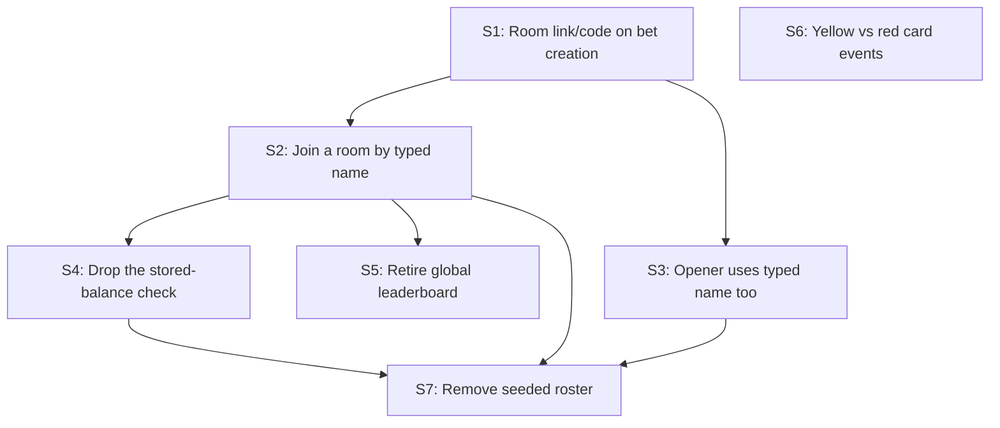

# Squad Picks v2 — Ephemeral Rooms slice plan

Source: [`PRD-v2-rooms.md`](../PRD-v2-rooms.md)

**This is a migration on top of an already-built, already-merged app (v1, issues #1–#9), not a fresh MVP.** A lot of v1's machinery is reusable as-is because a "bet" and a "room" turn out to be the same thing — chat, live-score display, and settlement are already scoped by `bet_id`. The pivot is narrower than it first looks: replace the fixed-roster dropdown identity with ad-hoc per-room names, add a shareable link/code, and retire the season-long leaderboard in favor of a per-room result. Not a rewrite.

## Assumptions

- **Stake has no meaning outside its own room** (PRD-v2 open question #1, flagged blocking there). Assumed default: it's a nominal number used only to split that room's pot among correct pickers — not a stored balance, not real money. This directly changes S4 below (drops the "insufficient points" check from v1's join flow, since there's nothing to check a balance against anymore). If this assumption is wrong, S4 and the settlement math need to be revisited before the rest of this plan makes sense.
- **The room "code" and the shareable link are the same thing** — visiting the link goes straight to that room's join screen. No separate manually-typed code as an access-control step.
- **Rooms don't expire** — a settled room stays viewable indefinitely.
- **No cap on room participants** for this phase.

None of these are invented product requirements — they're plumbing decisions needed to make the pivot buildable, each flagged rather than silently picked. Real per-issue open questions are on the issues themselves.

## Slices

| # | Slice | Newly demoable | Depends on |
|---|---|---|---|
| S1 | Opening a bet generates a shareable room link/code | The bet page displays a link that identifies that room | — |
| S2 | Joining a room via its link — type a display name, stake, and pick, no dropdown | A friend joins with just a typed name, no fixed roster | S1 |
| S3 | Opening a bet also uses a typed display name for the opener | The opener no longer picks "acting as" from a dropdown | S1 |
| S4 | Stake no longer checked against a stored balance | Anyone can join with any stake; payouts still compute correctly from that room's stakes alone | S2 |
| S5 | Global leaderboard retired; each room's own settled result stands alone | `/leaderboard` is gone; a room's result view doesn't imply a season ranking | S2 |
| S6 | Yellow and red cards shown as distinct live events | A red card and a yellow card post as visibly different chat events, not both generic "card" lines | — |
| S7 | Fixed 5-person seeded roster removed from schema/seed | A fresh install has no hardcoded squad — rooms are the only source of participants | S2, S3, S4 |

7 slices — within the 6-12 target, and smaller than it might look given how much of v1 is directly reusable.

## Dependency graph

S6 has no dependencies and can land whenever — it's unrelated to the identity pivot, purely a `lib/chat-events.ts` fix.

## Notes on ordering

- **S1 first**: nothing else in this plan means anything without a room to link to.
- **S2 and S3 both depend only on S1**, not on each other — they can be built in either order or in parallel; they establish the same ad-hoc-name pattern on two different forms (join vs. create).
- **S4 waits on S2** specifically because the balance check being removed lives inside the join flow S2 rewrites — touching it before S2 lands would mean editing code that's about to be rewritten anyway.
- **S5 (retire leaderboard) waits on S2** because "who's a participant" changes shape once identity is ad-hoc; the per-room result view should reflect that before the season-wide page is pulled.
- **S6 is deliberately unordered** relative to everything else — flagged in the table as parallelizable, since it's an isolated fix with zero relationship to the identity pivot. Pick it up whenever it's convenient.
- **S7 last**: only safe to drop the seeded roster once nothing in the app still depends on `squad_members` existing as a fixed list (S2, S3, S4 all need to have landed first).

## Slice 1 — is it thin enough?

S1 is just: generate an identifier for the bet's room (the bet's own id is arguably sufficient — the "link" may be as simple as `/rooms/<bet-id>` rather than needing a new random-token column) and display it on the bet page with a copy-friendly format. No join-flow changes yet — that's S2. Worth deciding during implementation whether a bet's existing numeric id is an acceptable "code" or whether a separate unguessable token is wanted instead (numeric ids are sequential and guessable — flagged on the S1 issue itself as an open question, not decided here).
