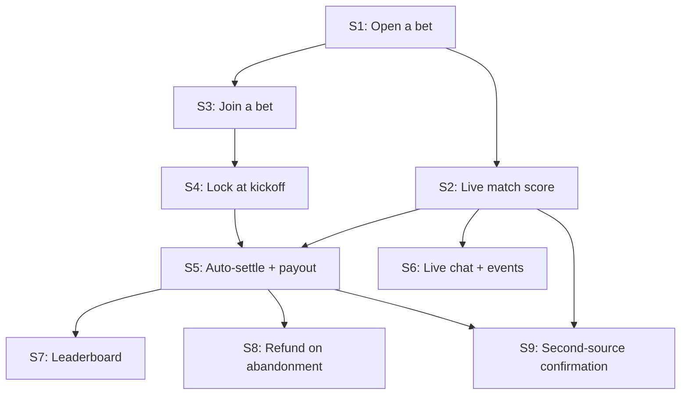

# Squad Picks — Points MVP slice plan

Source: [`PRD.md`](../PRD.md)

## Assumptions

- **Platform: web app.** No existing repo, so slice 1 bootstraps one — Next.js + Postgres (or an equivalent conventional stack) is the pick; not dictated by the PRD, chosen for speed.
- **No real authentication or squad invite flow.** The PRD never lists squad creation/invite as a capability — only "invite-only, 4-6 people" as context. This issue set assumes one pre-seeded squad with a handful of fixed member accounts throughout. If real onboarding is needed later, it's a separate slice map, not folded in here.
- **No fee slice.** The PRD's own open questions mark the fee mechanism as unresolved and non-blocking, and no PRD capability mentions charging one. This MVP pays out the full pot with no deduction; add a fee slice once the mechanism (pot deduction vs. subscription) is actually decided.
- **Starting points balance is an arbitrary seeded number**, since the PRD doesn't specify one (flagged on S3).
- **Abandoned-match detection is a manual admin trigger**, not automatic — the live data source has no dedicated status field for it (flagged on S8).
- **"Match finished" is whatever the data source reports as terminal status** — extra time / stoppage time / penalties nuance is unresolved in the source material and flagged as an open question on S5, not silently decided.

None of these are PRD capabilities being invented — they're plumbing decisions needed to make the sliced-out capabilities buildable. Real per-issue open questions are listed on the issues themselves, not just here.

## Slices

| # | Slice | Newly demoable | Depends on |
|---|---|---|---|
| S1 | Open a bet on a real match with a stake and pick | A bet exists, persisted, viewable on its own page | — |
| S2 | Bet page shows the real match's live status/score | Real live score displayed, sourced from `livescore-pp-cli` | S1 |
| S3 | Other squad members join an open bet | Multiple participants and their picks on one bet | S1 |
| S4 | Bet locks at kickoff | Joining after kickoff is rejected; status shows "locked" | S3 |
| S5 | Auto-settle and payout on match finish | Points move automatically to the correct picker(s), no admin step | S2, S4 |
| S6 | Live chat with auto-posted match events | Chat shows messages + system-posted goals/cards in real time | S2 |
| S7 | Season leaderboard | Every member's running points + record, aggregated from real settlements | S5 |
| S8 | Refund on abandoned/postponed match | Full stake refund instead of a settlement | S5 |
| S9 | Second-source confirmation before settling | Settlement holds instead of paying out when sources disagree | S2, S5 |

9 slices — within the 6-12 target for an MVP.

## Dependency graph

## Notes on ordering

- **S2 lands right after the skeleton, not last**, per the "riskiest integration next" heuristic — the live-score dependency is the shakiest part of the whole system (a scraper with documented data gaps), and every downstream slice (S5, S6, S8, S9) depends on it, so problems there are cheapest to find early.
- **S9 (second source) is deliberately last** — it's "defer breadth": ship the single-source path (S2 → S5) working first, then add the confirmation layer, rather than building dual-source reconciliation before the primary path is even proven.
- **Something demoable by slice 3-4**: by S3/S4, a full open-bet-and-join loop is visible even without settlement — satisfies the "stakeholder demo by slice 3-4" heuristic.
- Not sliced at all: real money/stablecoin, any fee mechanism, real auth/squad invite — all explicitly out of scope per the PRD's own non-goals and open questions.

## Slice 1 — is it thin enough?

S1 is a single form → single endpoint → single row → single page render, with everything else (matches, squad members) hardcoded/seeded. It doesn't touch the live data source, joining, locking, or settlement. This is about as thin as a "create and view a bet" skeleton gets — flag if you'd rather cut even the validation and add it in S3 instead.
